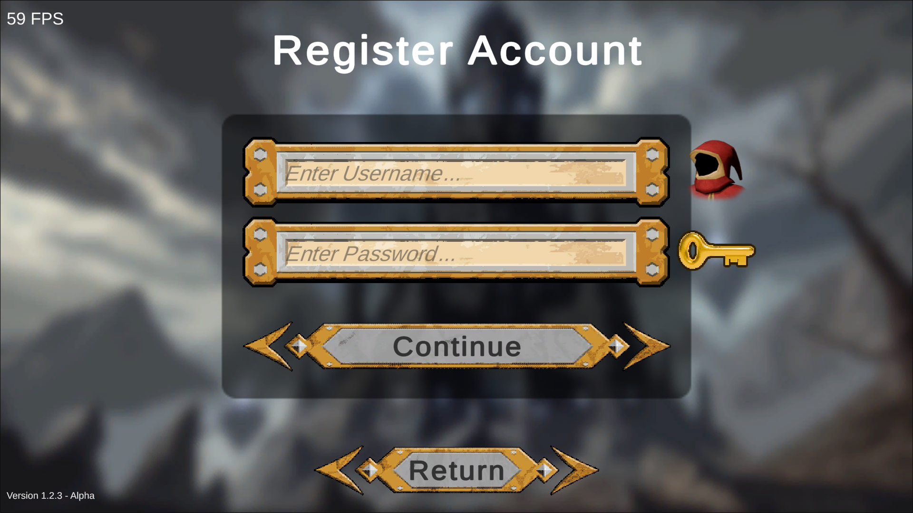

# **Información del Proyecto**

**Universidad Rey Juan Carlos**  
**JUEGOS PARA WEB Y REDES SOCIALES**  
**Nombre:** Daniel Rodríguez Ariza  
**Grado:** Grado en Diseño y Desarrollo de Videojuegos  
**Curso:** 4º  
**Grupo:** J

# **GDD - Wizard's Death Wish by Magic Cow Games**

**·Índice de Contenidos:**

* [**1 \- Introducción**](#1---introducción)

  * [1.1 \- Concepto](#11---concepto)

  * [1.2 \- Género](#12---género)

  * [1.3 \- Historia](#13---historia)

  * [1.4 \- Personajes](#14---personajes)

  * [1.5 \- Características Principales](#15---características-principales)

  * [1.6 \- Propóstio](#16---propóstio)

  * [1.7 \- Públic Objetivo](#17---públic-objetivo)

  * [1.8 \- Tecnologías Utilizadas](#18---tecnologías-utilizadas)

  * [1.9 \- Plataformas](#19---plataformas)

  * [1.10 \- Alcance](#110---alcance)

  * [1.11 \- Licencia Software](#111---licencia-software)

* [**2 \- Mecánicas**](#2---mecánicas)

  * [2.1 \- Concepto](#21---concepto)

  * [2.2 \- Jugabilidad](#22---jugabilidad)

  * [2.3 \- Flujo de Juego](#23---flujo-de-juego)

  * [2.4 \- Cámara](#24---cámara)

  * [2.5 \- Controles](#25---controles)

  * [2.6 \- Movimiento y Físicas](#26---movimiento-y-físicas)

  * [2.7 \- Niveles y Misiones](#27---niveles-y-misiones)

  * [2.8 \- Sistema de Magia](#28---sistema-de-magia)

  * [2.9 \- Objetos](#29---objetos)

    * [2.9.1 \- Monedas:](#291---monedas)

    * [2.9.2 \- Gemas:](#292---gemas)

    * [2.9.3 \- Coleccionables:](#293---coleccionables)

    * [2.9.4 \- Pociones:](#294---pociones)

    * [2.9.5 \- Llaves:](#295---llaves)

    * [2.9.6 \- Pergaminos:](#296---pergaminos)

  * [2.10 \- Sistema de Puntuación](#210---sistema-de-puntuación)

* [**3 \- Interfaces**](#3---interfaces)

  * [3.1 \- Interfaces de Menús](#31---interfaces-de-menús)

    * [3.1.1 \- Pantalla de Inicio](#311---pantalla-de-inicio)

    * [3.1.2 \- Menú Principal](#312---menú-principal)

    * [3.1.3 \- Menú de Tutorial](#313---menú-de-tutorial)

    * [3.1.4 \- Menú de Créditos](#314---menú-de-créditos)

    * [3.1.5 \- Menú de Opciones](#315---menú-de-opciones)

    * [3.1.6 \- Menú de Cuenta](#316---menú-de-cuenta)

  * [3.2 \- Interfaces de Juego](#32---interfaces-de-juego)

    * [3.2.1 \- Menú de Pausa](#321---menú-de-pausa)

    * [3.2.2 \- Interfaz del Jugador](#322---interfaz-del-jugador)

    * [3.2.3 \- Interfaz de Consola de Comandos](#323---interfaz-de-consola-de-comandos)

  * [3.3 \- Diagrama de Flujo](#33---diagrama-de-flujo)

* [**4 \- Modelo de Negocio y Monetización**](#4---modelo-de-negocio-y-monetización)

  * [4.1 \- Modelo de Negocio](#41---modelo-de-negocio)

  * [4.2 \- Monetización](#42---monetización)

  * [4.3 \- Mapa de Empatía](#43---mapa-de-empatía)

    * [4.3.1 \- ¿Qué Piensa y Siente?](#431---¿qué-piensa-y-siente?)

    * [4.3.2 \- ¿Qué Oye?](#432---¿qué-oye?)

    * [4.3.3 \- ¿Qué Ve?](#433---¿qué-ve?)

    * [4.3.4 \- ¿Qué Dice?](#434---¿qué-dice?)

    * [4.3.5 \- ¿Qué Hace?](#435---¿qué-hace?)

    * [4.3.6 \- Resultados que Buscan](#436---resultados-que-buscan)

    * [4.3.7 \- Esfuerzos y Frustraciones](#437---esfuerzos-y-frustraciones)

    * [4.3.8 \- Conclusión](#438---conclusión)

    * [4.3.9 \- Imagen del Mapa de Empatía](#439---imagen-del-mapa-de-empatía)

  * [4.4 \- Caja de Herramientas](#44---caja-de-herramientas)

  * [4.5 \- Lienzo de Modelo de Negocio](#45---lienzo-de-modelo-de-negocio)

* [**5 \- Postmortem**](#5---postmortem)

  * [5.1 \- Lo que salió bien](#51---lo-que-salió-bien)

    * [5.1.1 \- Eficiencia gracias a la redacción del GDD](#511---eficiencia-gracias-a-la-redacción-del-gdd)

    * [5.1.2 \- Sistema de localización](#512---sistema-de-localización)

  * [5.2 \- Lo que salió mal](#52---lo-que-salió-mal)

    * [5.2.1 \- Tiempo y deadlines](#521---tiempo-y-deadlines)

    * [5.2.2 \- Scope creep](#522---scope-creep)

  * [5.3 \- Lecciones Aprendidas](#53---lecciones-aprendidas)

    * [5.3.1 \- Repartir mejor el tiempo](#531---repartir-mejor-el-tiempo)

    * [5.3.2 \- Mantener un scope razonable](#532---mantener-un-scope-razonable)

* [**6 \- Bibliografía**](#6---bibliografía)

# **·Índice de Figuras:**

* [Figura 1 : Imagen del Menú Principal](#figura-1--imagen-del-menú-principal)

* [Figura 2 : Imagen del menú de Opciones](#figura-2--imagen-del-menú-de-opciones)

* [Figura 3 : Imagen del menú de Cuenta](#figura-3--imagen-del-menú-de-cuenta)

* [Figura 4 :  Imagen del menú de Registro de Cuenta](#figura-4--imagen-del-menú-de-registro-de-cuenta)

* [Figura 5 : Mapa de Empatía](#figura-5--mapa-de-empatía)

* [Figura 6 : Caja de Herramientas](#figura-6--caja-de-herramientas)

* [Figura 7 : Lienzo de Modelo de Negocio](#figura-7--lienzo-de-modelo-de-negocio)

# 

# **1 \- Introducción**

El presente documento presenta una propuesta para un videojuego competitivo con estrategia, que mezcla elementos de acción y arcade con una temática fantástica, creado por la compañía **Magic Cow Games**.

“**Wizard’s Death Wish**” es un videojuego competitivo arcade con gran nivel de rejugabilidad y entretenimiento, con elementos de fantasía medieval, con un fuerte énfasis en el uso de la magia y con un sistema de magia elemental que permite al usuario realizar conjuros creados dinámicamente en tiempo real (“**dynamic spellcasting**”).

Este documento tiene como propósito describir los distintos aspectos que conforman el juego, así como permitir la elaboración de los detalles de implementación del producto y el modelo de negocio que será utilizado para la distribución del juego.

La información expuesta en este documento está sujeta a ser expandida y/o modificada conforme se avanza en el desarrollo del juego.

## **1.1 \- Concepto**

En “**Wizard’s Death Wish**”, el jugador toma el papel de un poderoso mago despiadado el cuál ha sido despojado de su magia por sus atroces actos contra la humanidad. Para evitar que abuse de su poder, es castigado por la Orden de Magos y es encerrado en La Torre, una prisión para todos los malvados hechiceros del mundo.

El jugador tendrá que embarcarse en una misión para recuperar sus poderes y vengarse de aquellos que osaron oponerse a su poder, navegando múltiples niveles repletos de diferentes tipos de enemigos, puzzles y retos hasta recuperar todos sus poderes y alcanzar el nivel más alto de La Torre para poder escapar.

## 

## **1.2 \- Género**

“**Wizard’s Death Wish**” combina elementos de múltiples géneros de videojuegos. Contiene características de los siguientes géneros de videojuego:

* **Acción-Aventura**: El juego hace uso de elementos de combate rápido y exploración con una historia. Los jugadores asumen el papel de magos que se embarcan en una aventura épica para retomar sus poderes y hacerse más poderosos que cualquier otro mago, para finalmente lograr escapar de La Torre, explorando mazmorras y los diferentes niveles de La Torre a lo largo de la partida.  
    
* **Roguelike**: Los pisos de La Torre son mazmorras generadas proceduralmente, permitiendo que cada partida sea diferente. Cada vez que el jugador muere, pierde la partida y ha de comenzar de nuevo desde el primer nivel, permitiendo que el juego tenga un alto nivel de rejugabilidad. La habilidad del jugador mejora a medida que juega más partidas, incentivando a los jugadores a emplear más tiempo jugando para poder mejorar sus habilidades y lograr avanzar más pisos en La Torre, permitiendo avanzar en la historia del juego.  
    
* **Arcade**: El juego tiene un ritmo rápido, con controles simples y mecánicas fáciles de aprender. Se centra en obtener puntuaciones altas, incentivando a los jugadores a competir por llegar a lo más alto de la Tabla de Puntuaciones. Está diseñado para partidas de longitud variable y rejugables.  
    
* **Casual**: El juego ofrece entretenimiento rápido y accesible. La participación competitiva es opcional, permitiendo que los jugadores más casuales puedan disfrutar de la experiencia a su ritmo. Las mecánicas son directas y sencillas, además de ser intuitivas. No hay compromiso de tiempo y los jugadores pueden obtener gratificación inmediata al recaudar gran cantidad de bienes a lo largo de las partidas, como gemas y monedas que podrán ser utilizadas para comprar cosméticos y otros tipos de objetos que el jugador podrá utilizar.

## 

## **1.3 \- Historia**

En “**Wizard’s Death Wish**”, el jugador toma el papel de un mago sarcástico y hambriento de poder que está empeñado en recuperar su magia perdida y aplastar a cualquiera que se cruce en su camino.

Despojado de sus poderes y encarcelado por La Orden de Magos, le han encerrado en el fondo de La Torre, una enorme prisión para malvados hechiceros que amenazan con destruir el balance en el mundo haciendo uso de sus poderes para el mal.

El jugador ascenderá a través de un laberinto de trampas, acertijos, puzzles y enemigos mientras se dedica a recuperar su magia, burlándose de sus captores y saqueando todo lo encuentre a su paso con el objetivo de escapar de La Torre.

Con un sistema de lanzamiento de hechizos dinámicos que evoluciona a medida que el jugador recupera sus poderes, cada nivel presenta nuevas oportunidades caóticas para causar estragos.

El objetivo final es alcanzar lo alto de La Torre para así escapar de la prisión y lograr gobernar el mundo, atesorar riquezas y asegurarse de que todos recuerden su nombre como un legendario y poderoso mago.

## **1.4 \- Personajes**

A continuación, se detallan los personajes que forman parte del juego.

* **Mago Malvado**: El personaje jugable que controla el jugador. Adquiere el nombre escogido por el jugador al comenzar la partida.  
* **Mago de La Orden**: NPC. Es un poderoso mago que pertenece a La Orden de los Magos. Ataca al jugador por intentar escapar de La Torre. Hace uso de ataques con magia.  
* **Esqueleto**: NPC. Es un enemigo genérico de bajo nivel. Hace uso de ataques físicos con armas como espadas y arcos.  
* **Goblin**: NPC. Es un enemigo genérico de bajo nivel. Hace uso de ataques físicos con armas como hachas y garrotas. Algunos pueden cubrirse de ataques físicos haciendo uso de escudos.  
* **Bosses**: NPC. Variantes de otros tipos de NPC. Tienen mayor tamaño, fuerza y un gran nivel de salud. Poseen ataques especializados y en ocasiones son capaces de utilizar conjuros.

## 

## **1.5 \- Características Principales**

El videojuego “**Wizard’s Death Wish**” comprende las siguientes características de juego:

* **Uso de magia**: Los jugadores controlan a un mago que dispone de magia elemental para defenderse, atacar y resolver acertijos dentro de La Torre en la que ha sido encarcelado. El juego se centra principalmente en la habilidad del jugador para lanzar hechizos utilizando los elementos mágicos que tiene a su disposición. El jugador puede combinar y lanzar conjuros en tiempo real usando estos elementos, creando efectos destructivos o defensivos según lo requiera la situación.  
    
* **Sistema de conjuros dinámicos**: El sistema de magia no utiliza hechizos predefinidos. Los jugadores tienen a su disposición una serie de elementos y formas que pueden combinar para dar lugar a conjuros con ciertos efectos, permitiendo que los jugadores fabriquen y personalicen sus propios conjuros en función de la situación en la que se encuentren y el tipo de enemigo al que se enfrentan. Cada elemento posee características específicas, y combinarlos de distintas formas resulta en efectos únicos.  
    
* **Combinaciones elementales**: El juego incentiva al jugador a experimentar con las combinaciones de los diferentes elementos, descubriendo cómo interactúan entre sí. Existe una gran cantidad de combinaciones posibles, lo que significa que pueden existir múltiples soluciones para superar ciertos desafíos. Los elementos primarios pueden ser combinados para dar lugar a otros elementos secundarios, además, algunos elementos pueden contrarrestar a otros ya que son opuestos, lo que añade una capa adicional de estrategia en función de la interacción entre los elementos.  
    
* **Importancia de la estrategia**: Aunque el juego se centra en la acción frenética de lanzar conjuros, la estrategia es esencial para poder superar algunos de los retos que el jugador podrá encontrar en La Torre, ya que ciertos enemigos poseen inmunidad a ciertos elementos, por lo que es esencial que el jugador sea capaz de desarrollar una estrategia para contrarrestar las defensas de sus enemigos y acabar con ellos.  
    
* **Rejugabilidad**: La generación procedural de los pisos de La Torre y la gran variedad de combinaciones de magia aseguran que cada partida sea diferente. El juego ofrece una experiencia extremadamente rejugable.  
    
* **Vista cenital reducida**: El juego posee una vista cenital reducida, permitiendo al jugador poder ver todos los elementos que hay en el espacio a su alrededor, pero ocultado aquellos que queden fuera de su campo de visión.  
    
* **Competitividad**: Aunque “**Wizard’s Death Wish**” es principalmente una experiencia en solitario, el juego ofrece un sistema de puntuación y clasificación con score boards donde visualizar la posición de los jugadores con las mayores puntuaciones, creando un entorno competitivo en el que los jugadores aspiran a superar a los demás para demostrar que son los magos más poderosos.  
    
* **Alto Nivel de Habilidad**: El sistema de magia con hechizos dinámicos exige precisión y rapidez mental, además de un gran nivel de agilidad para poder conjurar a gran velocidad y superar los retos que se encuentren en los pisos de La Torre. El juego tiene una curva de aprendizaje con un alto skill-cap.  
    
* **Sencillez**: Aun a pesar de tener un sistema de magia con gran profundidad, los jugadores más casuales podrán superar los niveles con suficiente esfuerzo haciendo uso de conjuros más sencillos. No es necesario realizar las combinaciones óptimas para superar el juego, pero el juego recompensa a los jugadores más hábiles y rápidos en la ejecución de conjuros.  
    
* **Condición de Victoria**: Para ganar en “**Wizard’s Death Wish**”, el jugador debe superar todos los pisos de La Torre y escapar. Para poder escapar, el jugador tendrá que superar una lucha contra un Boss Final.

## **1.6 \- Propóstio**

El propósito del juego “**Wizard’s Death Wish**” es crear adicción en el jugador para cautivar a la mayor cantidad de jugadores potenciales posibles.

Esta adicción es generada mediante el sistema de magia con mecánicas profundas que permiten al jugador emplear incontables horas explorando los conjuros que puede crear.

Además, los niveles son generados proceduralmente, por lo que los jugadores emplean grandes cantidades de tiempo explorando los niveles generados en cada piso de La Torre y en cada partida, expandiendo el tiempo de juego y ofreciendo un gran nivel de rejugabilidad.

## 

## **1.7 \- Públic Objetivo**

El público objetivo de “**Wizard’s Death Wish**” es un amplio rango de jugadores, incluyendo tanto jugadores casuales como competitivos, ya que es un juego que está compuesto por características de múltiples géneros, por lo que cada tipo de jugador puede encontrar algo que disfrutar en el juego.

* Es un público multigeneracional, ya que es un juego apto para cualquier persona cuya afición son los juegos de fantasía medieval con elementos centrados en la magia.

* Jugadores que disfruten del combate en tiempo real, mezclado con la exploración de niveles y una historia de fantasía.

* Jugadores que encuentren atractivo el enfoque dinámico y entretenido con una jugabilidad rápida y desafiante.  
    
* Jugadores a los que les apasione el desafío de dominar el sistema de hechizos del juego. El jugador puede experimentar con una amplia selección de combinaciones elementales con las que crear diferentes hechizos, desde ataques elementales hasta escudos protectores.  
    
* Gran atractivo para jugadores que quieren superarse, mejorando sus habilidades con cada partida.  
    
* Parte del público objetivo son jugadores casuales que sencillamente disfrutan del humor del juego y de recolectar coleccionables, monedas, gemas y eliminar enemigos sin necesidad de optimizar conjuros.

* Jugadores a los que les guste obtener todos los cosméticos para personalizar su personaje.

## 

## 

## **1.8 \- Tecnologías Utilizadas**

Para el eficiente desarrollo de un videojuego, es preciso hacer uso de un framework profesional que ofrezca herramientas de desarrollo maduras y que permitan crear productos de alta calidad.

Es por esta razón que se ha decidido hacer uso del motor de desarrollo **Unity**, haciendo uso del lenguaje de programación **C\#**, lo que permite programar sin comprometer la calidad del juego.

**Unity** es uno de los motores más potentes y avanzados disponibles a día de hoy, razón por la que es uno de los motores más utilizados en la industria de los videojuegos.

Además, Unity tiene soporte para exportar a múltiples plataformas de forma sencilla, por lo que es ideal para el desarrollo de “**Wizard’s Death Wish**”.

## 

## **1.9 \- Plataformas**

El juego “**Wizard’s Death Wish**” estará disponible como videojuego web, permitiendo ejecutar el juego en cualquier dispositivo con acceso a un navegador web, permitiendo así ser ejecutado tanto en ordenadores de sobremesa y portátiles como en dispositivos móviles como tablets y teléfonos móviles, entre otros.

El juego está desarrollado en **Unity**, haciendo uso del lenguaje de programación **C\#** y compilado con el build target de **WebGL**, por lo que puede ser ejecutado con alto rendimiento en todas las plataformas que tengan soporte para **WebGL**, incluyendo dispositivos móviles.

## **1.10 \- Alcance**

# 

El alcance del proyecto es crear un videojuego web para navegador programado en **Unity** haciendo uso de **WebGL** como backend de renderizado para obtener el mayor rendimiento posible en las diferentes plataformas.

El objetivo principal es desarrollar los sistemas de juego que permitan introducir contenido sin dificultad en futuras actualizaciones, permitiendo mantener a largo plazo con facilidad el juego, dándole una vida extendida, y permitiendo futuras ampliaciones del contenido.

## **1.11 \- Licencia Software**

# 

El juego “**Wizard’s Death Wish**” se distribuye bajo la licencia **GPL-3.0** (Licencia Pública General de GNU, versión 3). Esta licencia permite que el software sea libre y de código abierto, lo que implica que cualquier usuario tiene el derecho de ejecutar, estudiar, compartir y modificar el juego, siempre que se respeten los términos establecidos por la **GPL-3.0**.

# **2 \- Mecánicas**

Este apartado del documento se centra en detallar las mecánicas principales de “**Wizard’s Death Wish**”, un juego de acción y aventura, donde los jugadores combinan elementos mágicos en tiempo real para crear hechizos dinámicos y resolver combates, acertijos y puzzles.

El enfoque central está en un sistema de hechizos que permite combinaciones únicas en cada enfrentamiento.

## 

## **2.1 \- Concepto**

“**Wizard’s Death Wish**” es un juego de acción y aventura que ofrece a los jugadores la libertad de conjurar hechizos combinando varios elementos en tiempo real.

La mecánica principal gira en torno a crear y dominar una gran variedad de hechizos creados dinámicamente a partir de una serie de elementos básicos, con los que el jugador podrá combatir contra enemigos y resolver acertijos ambientales, aprovechando el ingenio y la experimentación mágica.

En “**Wizard’s Death Wish**”, el jugador encarna el papel de un poderoso mago despiadado el cuál ha sido despojado de su magia para evitar que abuse de su poder.

El jugador se encuentra encerrado en La Torre, una prisión para todos los malvados hechiceros del mundo, y tendrá que embarcarse en una misión para recuperar sus poderes y escapar de La Torre, navegando múltiples niveles repletos de diferentes tipos de enemigos, puzzles y retos hasta recuperar todos sus poderes y alcanzar el nivel más alto de La Torre y así poder escapar.

Los niveles son generados proceduralmente, lo que fomenta la exploración y permite un gran aprovechamiento de las mecánicas de creación de hechizos dinámicos en tiempo real.

## 

## **2.2 \- Jugabilidad**

La jugabilidad de “**Wizard’s Death Wish**” se centra en la acción a través de combates dinámicos y la exploración de entornos desafiantes generados proceduralmente.

El jugador progresa a medida que perfecciona sus habilidades mágicas, desbloqueando nuevos elementos, formas y aprendiendo a combinar diferentes elementos para enfrentarse a enemigos cada vez más poderosos y con resistencia a ciertos elementos mágicos, así como resolver acertijos, puzzles y superar obstáculos del entorno.

Cada nivel presenta nuevos retos, incitando a los jugadores a experimentar con combinaciones para adaptarse a diversas situaciones.

A continuación se detallan ciertos elementos de la Jugabilidad del videojuego “**Wizard’s Death Wish**”:

* **Movilidad**: En “**Wizard’s Death Wish**”, el jugador controla a un mago, el cual puede desplazarse por todo el entorno. Se puede hacer uso de conjuros de mejora de movilidad para incrementar la velocidad del jugador temporalmente o para teletransportarse a una nueva posición.  
    
* **Elementos**: El sistema de magia hace uso de una serie de elementos primarios como el agua, el fuego y la electricidad para generar conjuros dinámicamente en tiempo real al combinarlos. Algunos de estos elementos primarios pueden ser combinados entre sí para dar lugar a elementos secundarios como el hielo y el vapor, dando lugar a combinaciones de mayor complejidad.  
    
* **Conjuros Dinámicos**: El jugador puede ejecutar conjuros creados dinámicamente a partir de elementos básicos. La ejecución de un conjuro es instantánea y genera el efecto de los elementos combinados por el jugador. La forma final de cada conjuro se ve afectada por la forma escogida, permitiendo manifestar conjuros en forma de muros, rayos y proyectiles.

* **Personajes**: El jugador puede encontrarse una serie de personajes a lo largo de las partidas, principalmente enemigos que le atacarán. Cada personaje del juego tiene una serie de resistencias y debilidades a ciertos elementos, por lo que el jugador tendrá que aprender a identificar estas resistencias y combatirlas haciendo uso de diferentes elementos.

* **Objetos Destruibles**: El entorno está poblado de objetos de diferentes tipos. El jugador puede encontrar objetos destruibles, los cuales pueden ser daños y eliminados haciendo uso de la magia, permitiendo acceder a nuevas zonas del nivel o abriendo zonas donde encontrar nuevos objetos.  
    
* **Objetos Modificables**: El entorno contiene diferentes tipos de objetos que pueden ser modificados al ser afectados por diferentes elementos mágicos. Por ejemplo, puertas de madera que pueden ser quemadas, superficies de agua que pueden ser congeladas, fuegos que pueden ser apagados con agua, etc…  
    
* **Dinero, Gemas y Coleccionables**: El jugador puede encontrar diferentes objetos a lo largo del nivel como coleccionables, gemas y dinero. El dinero y las gemas recolectadas pueden ser utilizados posteriormente para comprar cosméticos en la tienda. Los coleccionables son objetos únicos que el jugador puede encontrar en los niveles. Al recolectarlos, obtendrá logros.  
    
* **Puzzles Elementales**: Los entornos en “**Wizard’s Death Wish**” están repletos de una gran variedad de habitaciones y zonas explorables. En algunas de estas zonas, el jugador podrá encontrar puzzles que requerirán el uso de la magia elemental con una combinación específica para poder ser resueltos, abriendo el paso a las siguientes zonas del nivel.  
    
* **Exploración de Entornos**: Cada piso de La Torre es un nivel generado proceduralmente y con una gran variedad de posibles generaciones. Este tipo de generación de niveles hace que ninguna partida sea igual, y fomenta la exploración de niveles, haciendo que los jugadores siempre tengan una razón para explorar los entornos.

## 

## **2.3 \- Flujo de Juego**

El flujo de juego de “**Wizard’s Death Wish**” sigue un ciclo de exploración, combate y resolución de acertijos y puzzles. Los jugadores recorren niveles que plantean obstáculos específicos, con momentos de descanso para analizar y planificar combinaciones de hechizos.

A medida que avanzan, se desbloquean nuevos elementos y formas de magia, aumentando las posibilidades de combinación y complejidad de hechizos, incentivando la rejugabilidad.

A continuación, se procede a detallar en mayor profundidad el flujo de una partida:

Al pulsar el botón para comenzar la partida, el jugador aparecerá en el piso más bajo de La Torre, dentro de la celda en la que el personaje principal ha sido encerrado.

El jugador comienza la partida sin magia, ya que el personaje ha sido despojado de toda su magia mediante una maldición lanzada por la Orden de los Magos.

A pesar de esa maldición, como el personaje controlado por el jugador ha sido un mago tan poderoso, todavía tiene ciertas remanencias de su magia, y es así como el jugador desbloquea su primer poder elemental, que es el **Fuego**.

Al salir de la celda, el jugador se encontrará en una mazmorra y deberá encontrar las escaleras para subir al siguiente piso, que es la salida del nivel.

Mientras explora el nivel, el jugador será atacado por las diferentes criaturas que habitan La Torre y los guardias de la misma que intentarán evitar que escape.

El jugador podrá recolectar diferentes tipos de objetos que se encontrarán dispuestos por el nivel.

* **Monedas**: Se encontrarán repartidas por el nivel, además de ser generadas al eliminar a los enemigos.  
* **Gemas**: Se encuentran en salas a las que se accede al resolver ciertos puzzles.  
* **Coleccionables**: Se obtienen al resolver una serie de puzzles de mayor dificultad.  
* **Pociones**: Mientras el jugador no tenga acceso a todos los elementos, requerirá hacer uso de pociones para poder restaurar su vida.  
* **Llaves**: El jugador necesita encontrar la llave para acceder al siguiente nivel.  
* **Pergaminos**: Desvelan combinaciones especiales que otorgan poderes al jugador, como la teletransportación, incremento de velocidad, lluvia de meteoritos o crear agujeros negros, entre otros poderes sobrenaturales.

Al encontrar las escaleras de salida de un piso, se llegará al final del nivel, dónde habrá una puerta que únicamente puede ser abierta con una llave que es soltada por el boss del piso, por lo que el jugador tendrá que explorar el nivel hasta encontrar y eliminar a todos los enemigos que se encuentren en su camino.

Al finalizar el nivel, el jugador visualizará una pantalla de victoria con sus estadísticas en el nivel que acaba de superar, mostrando las kills, el tiempo que ha tardado, el dinero que ha recolectado, las gemas que ha recolectado, los coleccionables obtenidos y otras estadísticas como la precisión de sus conjuros.

Al comenzar el siguiente nivel, el jugador se encontrará en la **Safe Room**, una sala que le permite descansar, curarse y reponerse antes de comenzar la acción del siguiente nivel.

A medida que se suben los niveles, la dificultad de los enemigos incrementa, aumentando su vida, su daño y pudiendo aparecer nuevos tipos de enemigos más poderosos.

El jugador podrá seguir avanzando niveles en La Torre, hasta que muera, o hasta que logre llegar a lo alto de La Torre y finalizar la partida.

Al finalizar la partida llegando a lo alto de La Torre, se desbloquea el modo libre, que permite jugar ascendiendo niveles de forma indefinida, permitiendo extender la vida del juego para jugadores competitivos a los que les gustan los retos de alta dificultad. En este modo no hay eventos relacionados con la historia del juego.

Si el jugador muere durante la partida, perderá su progreso y volverá al menú principal. Las monedas, gemas y coleccionables recolectados son guardados y agregados al perfil del jugador.

Si el jugador abandona una partida sin haber muerto, se cargará nuevamente su progreso actual desde el piso dónde apago el juego. Al abandonar la partida, el progreso obtenido dentro del nivel será perdido, solamente se guarda el progreso realizado al llegar al final de los niveles, antes de cargar la Safe Room del siguiente piso.

Cada vez que se inicie una nueva partida, siempre se comenzará desde el nivel más bajo de La Torre.

## **2.4 \- Cámara**

El juego “**Wizard’s Death Wish**” hace uso de una cámara en tercera persona, con vista isométrica, elevada por encima del entorno para ofrecer una vista completa del área alrededor del jugador, permitiendo ver los objetos y los enemigos con claridad durante el combate.

La perspectiva de la cámara facilita ver los efectos de los hechizos y las reacciones de los enemigos en tiempo real.

El jugador tiene un control limitado sobre la cámara para poder enfocarse en crear hechizos rápidamente.

La cámara sigue al jugador, por lo que el área de visibilidad es el entorno que se encuentra inmediatamente alrededor del personaje jugable, facilitando visualizar las acciones realizadas por el jugador.

## 

## **2.5 \- Controles**

“**Wizard’s Death Wish**” utiliza un esquema de controles intuitivo que permite al jugador combinar elementos rápidamente.

El juego implementa soporte para controles tanto para teclado y ratón como para pantallas táctiles, permitiendo soportar ordenadores de sobremesa, portátiles, tablets y teléfonos móviles.

* **Esquema de Controles para Teclado y Ratón**:  
  * **Apuntar**: El jugador puede apuntar desplazando el ratón. El personaje jugable mirará en la dirección en la que se encuentre el puntero en la pantalla.  
      
  * **Desplazamiento**: El jugador se desplaza usando el click izquierdo. Al pulsar el botón de desplazamiento, el personaje caminará en la dirección del puntero.  
      
  * **Combinación de Elementos**: Los elementos se combinan haciendo uso de las teclas del teclado. Cada elemento tiene una tecla asociada. Por defecto:  
    * **Q**: Agua  
    * **W**: Curación  
    * **R**: Frío  
    * **A**: Electricidad  
    * **S**: Muerte  
    * **D**: Roca  
    * **F**: Fuego  
        
  * **Seleccionar Forma**: La forma del conjuro puede ser seleccionada haciendo uso de las teclas numéricas. Cada forma tiene una tecla asociada. Por defecto:  
    * **1**: Proyectil  
    * **2**: Rayo  
    * **3**: Escudo

    

  * **Lanzar Hechizo**: El hechizo es lanzado haciendo uso del click derecho. El hechizo es lanzado en la dirección que esté apuntando el jugador.  
      
  * **Pausar**: El juego puede ser pausado presionando la tecla de pausa. Esta tecla por defecto es el escape.

* **Esquema de Controles para Pantallas Táctiles**:  
  * **Apuntar**: El jugador puede apuntar tocando en la pantalla. El personaje jugable mirará en la dirección en la que se haya presionado en la pantalla táctil.  
      
  * **Desplazamiento**: El jugador se desplaza deslizando el dedo por la pantalla. El jugador caminará hasta la posición en la que se haya realizado la pulsación.  
      
  * **Combinación de Elementos**: Los elementos se combinan haciendo uso de los botones táctiles que hay en pantalla. Cada elemento tiene un botón asociado con un icono correspondiente que es fácilmente reconocible.

    

  * **Seleccionar Forma**: La forma del conjuro puede ser seleccionada haciendo uso de botones táctiles que hay en pantalla. Cada forma tiene un botón asociado con un icono correspondiente que es fácilmente reconocible.  
      
  * **Lanzar Hechizo**: El hechizo es lanzado realizando una pulsación en pantalla mientras se tengan elementos dentro de la secuencia elemental del conjuro.  
      
  * **Pausar**: El juego puede ser pausado presionando un botón táctil que se encuentra en una esquina de la pantalla.

## **2.6 \- Movimiento y Físicas**

El movimiento de los personajes y objetos del entorno se basa en un sistema de físicas simple, capaces de computar colisiones e interacciones entre objetos sin consumir una gran cantidad de recursos.

El jugador tiene  una velocidad de desplazamiento moderada que puede ser incrementada haciendo uso de hechizos de desplazamiento como incrementar la velocidad del jugador o teletransportarse, lo que incentiva a los jugadores a hacer uso de las herramientas a su disposición para facilitar el desplazamiento a través de los niveles.

Los personajes con habilidades mágicas, incluyendo al jugador, NO pueden desplazarse mientras lanza hechizos, lo que añade una capa de estrategia y habilidad al posicionamiento durante los combates, forzando al jugador a pensar en su estrategia de combate antes de lanzarse a luchar contra los enemigos ciegamente.

La física de los hechizos es interactiva y afecta tanto a enemigos como al entorno. Por ejemplo, un hechizo de agua moja a las entidades y permite incrementar el daño de los conjuros eléctricos, permitiendo electrocutar a los enemigos.

## **2.7 \- Niveles y Misiones**

En “**Wizard’s Death Wish**” cada nivel es generado proceduralmente y corresponde a un piso de La Torre, además de seguir una cierta temática o “bioma”.

La temática de los niveles determina el tipo de entornos que se encontrarán en el piso, además de las características del mismo. Las características de los niveles permiten que el jugador aproveche ciertos elementos para resolver diferentes tipos de puzzles elementales. Por ejemplo, en un nivel con temática de hielo existirán superficies que podrán ser derretidas por el fuego, abriendo paso a nuevas secciones del nivel.

Algunos de los pisos son niveles específicos prefabricados que contienen un layout diseñado específicamente para dicho nivel. Estos pisos corresponden con niveles en los que se desarrollará parte de la historia, y solo ocurren cada cierta cantidad de pisos generados proceduralmente. En estos niveles, el jugador se encontrará con bosses especiales que corresponden con algún personaje único y relevante para el desarrollo de la historia.

En cada nivel el jugador puede encontrar diferentes tipos de eventos, como combates de bosses secundarios con patrones y elementos específicos que obligan al jugador a experimentar con diferentes tipos de hechizos hasta encontrar la combinación que mejor resultados de contra el enemigo.

Los niveles están repletos de objetos que pueden ser recolectados, como puedan ser pergaminos que desbloqueen nuevos poderes, pociones de curación, dinero, gemas u objetos coleccionables.

## 

## **2.8 \- Sistema de Magia**

El sistema de magia es el núcleo del gameplay en “**Wizard’s Death Wish**”. El sistema de magia se basa en la combinación de elementos en tiempo real permitiendo que el jugador pueda crear conjuros personalizados mientras está jugando.

Existen 7 elementos primarios y 2 elementos secundarios, dando lugar a un total de 9 elementos con los que combinar para crear cientos de combinaciones posibles, garantizando que los jugadores tengan un nivel de libertad absoluta.

Los conjuros se crean a partir de la combinación de 5 elementos y una forma. Los elementos determinan los efectos del conjuro, mientras la forma determina la manifestación física del conjuro.

A continuación se detallan los componentes del sistema de magia en “**Wizard’s Death Wish**” y la interacción entre los diferentes elementos:

* **Elementos**: Determinan los efectos del conjuro. Se pueden combinar 5 elementos en un conjuro.  
    
  * **Elementos Primarios**:  
    * **Agua**: Puede mojar a los objetivos. Permite apagar fuegos.  
    * **Curación**: Restaura los puntos de vida del objetivo. Los muertos vivientes y los demonios son dañados por este elemento.  
    * **Frío**: Puede congelar a los objetivos. Permite apagar fuegos y crear hielo.  
    * **Electricidad**: Permite electrocutar a los objetivos.  
    * **Muerte**: Elemento de daño genérico. Consume la vida de los objetivos. Los muertos vivientes y los demonios son curados por este elemento.  
    * **Tierra**: Elemento que permite generar tierra y rocas.  
    * **Fuego**: Puede quemar a los objetivos. Las superficies de hielo son derretidas por este elemento. Las superficies de materiales combustibles como la madera son quemadas por este elemento.

    

  * **Elementos Secundarios**: Son obtenidos a partir de la combinación de elementos primarios.  
    * **Vapor**: Puede mojar y realizar daño de quemadura a los objetivos.  
    * **Hielo**: Elemento que permite generar piezas de hielo afiladas.

    

  * **Combinaciones**: Algunos elementos primarios pueden ser combinados para generar otros elementos secundarios. Los elementos opuestos se cancelan al combinarse, eliminando ambos elementos de la secuencia del conjuro.  
    * Agua \+ Fuego \= Vapor  
    * Agua \+ Frío \= Hielo  
    * Muerte \+ Curación \= Null  
    * Fuego \+ Frío \= Null

* **Formas**: Determinan la manifestación física del conjuro. Solo se puede utilizar una forma en cada conjuro.  
    
  * **Proyectil**: Permite lanzar un conjuro en forma de proyectil. Por ejemplo, bola de fuego.  
  * **Rayo**: Permite lanzar un conjuro en forma de rayo. Los rayos son disparados en línea recta hasta el objetivo al que está apuntando el jugador.  
  * **Escudo**: Permite generar muros con los elementos utilizados.

## **2.9 \- Objetos**

En el juego se pueden encontrar diferentes tipos de objetos, cada uno con su propio uso.

Algunos objetos son coleccionables mientras que otros son consumibles.

Los objetos pueden encontrarse de diferentes maneras durante una partida. Algunos objetos se encontrarán dispuestos de forma visible por el nivel y podrán ser recolectados directamente por el jugador. Otros objetos están escondidos dentro de objetos destruibles como cajas, barriles, vasijas y cofres.

Algunos de los objetos coleccionables son especiales y se encuentran detrás de una zona bloqueada por un puzzle o acertijo que el jugador deberá resolver haciendo un uso correcto de la magia y el entorno a su alrededor.

Los enemigos también pueden soltar objetos al ser eliminados. Normalmente se tratará de monedas. En algunos casos, dependiendo del tipo de enemigo, pueden soltar llaves que permitan progresar en el nivel.

El jugador podrá recolectar los diferentes tipos de objetos al entrar en contacto con ellos sin necesidad de realizar ningún tipo de entrada adicional para recolectarlos, evitando perder tiempo de acción durante la partida y facilitando los controles para los jugadores de dispositivos móviles.

Los diferentes tipos de objetos disponibles son los siguientes:

### **2.9.1 \- Monedas:**

Se encontrarán repartidas por el nivel, además de ser generadas al eliminar a los enemigos. Existen monedas de diferentes categorías de moneda, las cuales tienen diferente valor:  
**·** **Cobre**: 1 unidad  
**·** **Plata**: 5 unidades  
**·** **Oro**: 10 unidades

Las monedas recolectadas son guardadas al finalizar cada nivel, y pueden ser utilizadas en la tienda para comprar objetos puramente cosméticos.

### **2.9.2 \- Gemas:**

Se encuentran en salas a las que se puede acceder al resolver ciertos puzzles. Al costar más obtenerlas, su valor es más alto que el de las monedas.

Existen diferentes tipos de gemas, las cuales tienen diferente valor:  
	**· Rubí**: Gema de color rojo, la más común de todas. Valor de 50 unidades.  
**· Diamante**: Gema de color azul. Valor intermedio de 100 unidades.  
	**· Esmeralda**: Gema de color verde, la más rara de todas. Valor de 200 unidades.

Las gemas pueden ser intercambiadas en la tienda a cambio de monedas si el usuario lo desea, permitiendo así comprar objetos que tengan un gran valor monetario.

Algunos objetos de la tienda requieren gemas como pago adicional para ser adquiridos, por lo que el jugador deberá encontrar un balance entre conversión de gemas a dinero y conservación de gemas en función de los objetos cosméticos que desee adquirir.

### **2.9.3 \- Coleccionables:**

Se obtienen al resolver una serie de puzzles de mayor dificultad.

Los coleccionables de un nivel pueden ser combinados para obtener un objeto coleccionable que se puede visualizar posteriormente en un expositorio de los objetos del jugador.

Obtener todos los coleccionables en un nivel desbloquea un logro y el objeto coleccionable visualizable en el expositorio.

### **2.9.4 \- Pociones:**

Las pociones son objetos consumibles que el jugador puede utilizar para restaurar los puntos de vida rápidamente.

Mientras el jugador no tenga acceso al elemento de curación, será necesario hacer uso de pociones para poder restaurar los puntos de vida.

Todas las pociones de curación son idénticas y restauran la misma cantidad de puntos de salud.

### **2.9.5 \- Llaves:**

El jugador necesita encontrar una llave en cada nivel para poder abrir la puerta que da acceso al siguiente nivel. Esta llave es obtenida al derrotar al boss del nivel actual.

### **2.9.6 \- Pergaminos:**

Desvelan combinaciones específicas que otorgan poderes especiales al jugador. Estas combinaciones especiales pueden ser utilizadas para ejecutar poderosos conjuros con un efecto especial, como puede ser la teletransportación.

## **2.10 \- Sistema de Puntuación**

El juego “**Wizard’s Death Wish**” tiene un sistema de puntuación que valora al jugador por el número de enemigos eliminados, además de la efectividad con la que los elimine.

Cada enemigo eliminado otorga una puntuación determinada al jugador. La cantidad de puntos otorgados al eliminar al enemigo viene determinada por el tipo de enemigo y lo difícil que sea de derrotar, recompensando a los jugadores por ser capaces de alcanzar pisos más avanzados de La Torre, ya que los enemigos de niveles posteriores son de mayor dificultad.

Eliminar a los enemigos en racha genera un bonus de puntuación por realizar un combo de kills. Este bonus se manifiesta en forma de multiplicador, pudiendo llegar a multiplicar la puntuación obtenida hasta x5. El combo incrementa de nivel por cada 10 kills. Si pasan más de 10 segundos sin realizar una kill, el multiplicador del combo desaparece, volviendo a puntuar x1.

Además de tener un sistema de puntuación basado en kills, el juego tiene un sistema de puntuación basado en monedas recolectadas por cada nivel.

El juego cuenta con un servidor web en el cuál se almacena la información de los usuarios. Con esta información, el juego puede mostrar 2 tablas de puntuación: una para el top de mejores jugadores por kills, y el top de mejores jugadores por recolección de dinero.

# 

# 

# **3 \- Interfaces**

En “**Wizard’s Death Wish**”, las interfaces de usuario (User Interface / UI) han sido diseñadas para proporcionar una experiencia de juego envolvente e intuitiva, además de ser diseñadas para ser visualmente atractivas, dando lugar a interfaces claras e intuitivas.

Se ha centrado el desarrollo de interfaces alrededor de la creación de pantallas y menús en una disposición clara y ordenada, lo que permite que el jugador pueda encontrar rápidamente las opciones que necesita sin perder tiempo navegando por menús, permitiendo realizar acciones de una forma directa.

La estética de la interfaz es coherente y ha sido diseñada para cuadrar con la estética de fantasía medieval del juego, permitiendo sumergir al usuario en la experiencia de juego, incrementando la inmersión.

A continuación, se detalla la estructura de las principales interfaces del juego. También se ha agregado un diagrama de flujo que permite visualizar el recorrido de un jugador a través de las distintas pantallas y menús que existen en el juego.

## **3.1 \- Interfaces de Menús**

### **3.1.1 \- Pantalla de Inicio**

Es una escena cuyo propósito es cargar todos los sistemas estáticos del juego que existirán de forma persistente durante el resto del tiempo de ejecución.

Durante la breve carga, se puede visualizar una pantalla de bienvenida que consiste en un fondo de pantalla con una imagen de La Torre en la que transcurre el juego.

Esta pantalla existe únicamente para inicializar sistemas globales del juego y la carga es casi instantánea incluso en sistemas con pocos recursos, dando paso al menú principal poco después de lanzar el juego.

### **3.1.2 \- Menú Principal**

El menú principal es la primera interfaz completa que pueden visualizar los jugadores y ha sido diseñado para ser tanto funcional como atractiva.

El fondo de pantalla ayuda a comprender la temática del juego, mostrando La Torre en la que transcurren las partidas.

La interfaz del menú principal cuenta con elementos interactivos principales como "**Jugar**", "**Cuenta**", "**Opciones**", "**Créditos**" y “**Tutorial**”. Posteriormente, se agregarán más botones para incluir acceso a nuevos menús a medida que vaya evolucionando el desarrollo del proyecto, como por ejemplo el botón de acceso al menú de la **Tienda**.

Este diseño sencillo y directo permite a los jugadores acceder rápidamente a las secciones más importantes, mejorando la fluidez en la navegación.

El menú principal contiene los siguientes botones:

* **Jugar**: Comienza una nueva partida  
* **Cuenta**: Carga el menú de cuenta, donde el usuario puede crear y acceder a su cuenta.  
* **Opciones**: Carga el menú de configuración del juego.  
* **Créditos**: Carga el menú de créditos del desarrollo del videojuego.  
* **Tutorial**: Carga un menú de tutorial dónde se explican los controles básicos del juego.

### ****

#### *Figura 1 : Imagen del Menú Principal*

### 

### 

### **3.1.3 \- Menú de Tutorial**

El menú de tutorial es una interfaz que contiene toda la información necesaria para aprender a jugar el juego.

La ayuda ofrecida en este menú muestra imágenes en las que se explica al jugador detalladamente las mecánicas y nociones básicas del juego, además de tener un listado de las entradas por defecto para cada plataforma.

Este menú contiene los siguientes botones:

* **Avanzar**: Avanza a la siguiente página del tutorial  
* **Retroceder**: Retrocede a la página anterior del tutorial  
* **Volver**: Sale del menú de tutorial y retorna al menú principal

### 

### 

### **3.1.4 \- Menú de Créditos**

En el menú de créditos se muestran los créditos del equipo de desarrollo de **Magic Cow Games** que ha estado involucrado en el desarrollo del videojuego “**Wizard’s Death Wish**”.

Este menú contiene los siguientes botones:

* **Volver**: Sale del menú de créditos y retorna al menú principal

### 

### **3.1.5 \- Menú de Opciones**

El apartado de **Opciones** será fundamental para que el jugador pueda ajustar el juego a su gusto. Las opciones estarán divididas en varias categorías.

Actualmente solo existe la opción de cambiar el idioma del juego. A medida que se desarrolle el juego, se añadirán más opciones que podrán ser guardadas en la cuenta, permitiendo que los usuarios recuperen su configuración al acceder a su cuenta.

Este menú contiene los siguientes botones:

* **Idioma**: Permite seleccionar el idioma del juego  
* **Sonido**: Permite acceder a la configuración de volumen de sonido del juego  
* **Gráficos**: Permite cambiar la configuración gráfica del juego  
* **Volver**: Sale del menú de créditos y retorna al menú principal

## 

### 

#### *Figura 2 : Imagen del menú de Opciones*

### 

### 

### **3.1.6 \- Menú de Cuenta**

En este menú, el jugador tiene acceso a diferentes opciones para poder dar de alta, acceder y eliminar cuentas que permitirán almacenar la información del jugador en el servidor del juego.

El menú de cuenta tiene las siguientes pantallas:

* **Registrar Cuenta**: Accede a un menú dónde el usuario puede registrar una nueva cuenta, especificando el nombre de usuario y la contraseña.  
* **Acceder a Cuenta**: Accede a un menú dónde el usuario puede acceder a su cuenta escribiendo su información de acceso (nombre de usuario y contraseña).  
* **Volver**: Permite retroceder al menú principal.

## 

#### *Figura 3 : Imagen del menú de Cuenta*

*Figura 4 : Imagen del menú de Registro de Cuenta*

## **3.2 \- Interfaces de Juego**

### **3.2.1 \- Menú de Pausa**

Esta pantalla aparece cuando el usuario presiona la tecla de pausa. Permite pausar la ejecución del juego temporalmente, además de mostrar una serie de botones para acceder a diferentes opciones del juego.

Los botones de este menú son:

- **Reanudar**: Permite continuar la partida  
- **Opciones**: Permite acceder al menú de opciones desde la partida  
- **Abandonar**: Permite abandonar la partida y volver al menú principal

### **3.2.2 \- Interfaz del Jugador**

La interfaz del jugador muestra toda la información y las acciones necesarias para poder desarrollar la jugabilidad del juego durante las partidas.

En la interfaz se pueden visualizar botones con iconos para cada uno de los elementos mágicos que puede utilizar el jugador en las combinaciones para crear conjuros. Cada uno de los elementos tiene su propio botón con un icono único y fácil de reconocer.

También aparecen botones para seleccionar la forma que será utilizada por el conjuro. Cada una de las formas tiene su propio botón con un icono único y fácilmente reconocible.

En la parte superior de la pantalla se muestra la secuencia de elementos escogidos por el usuario para el conjuro actual, además de la forma seleccionada.

En un lateral de la pantalla se puede visualizar la barra de pantalla del jugador, mostrando de forma sencilla e intuitiva la cantidad de vida que le queda.

En esta pantalla también se pueden encontrar contadores con iconos para la puntuación, las monedas recolectadas y las gemas.

### **3.2.3 \- Interfaz de Consola de Comandos**

El juego “**Wizard’s Death Wish**” viene equipado con una consola de comandos programada enteramente desde cero para permitir al equipo de desarrollo acceder a características avanzadas y visualizar información de Debug durante el tiempo de ejecución en la build final durante los testeos de la build de WebGL en el web server.

A su vez, esta consola de comandos puede ser utilizada por usuarios técnicos si así lo desean.

Escribir el comando help permite visualizar una lista de todos los comandos incorporados en la consola.

Actualmente se han implementado 17 comandos.

## **3.3 \- Diagrama de Flujo**

A continuación, se muestra una imagen con el diagrama de flujo de los menús e interfaces del juego:

# 

# **4 \- Modelo de Negocio y Monetización**

En esta sección del documento se exponen los detalles de diseño de producto, el modelo de negocio utilizado por **Magic Cow Games** y la monetización del videojuego “**Wizard’s Death Wish**”.

## **4.1 \- Modelo de Negocio**

El videojuego “**Wizard’s Death Wish**” saldrá al mercado como un videojuego free-to-play, permitiendo que cualquier usuario pueda acceder de manera gratuita al producto y jugar sin necesidad de realizar ningún tipo de pago.

El modelo de negocio de “**Wizard’s Death Wish**” es free-to-play con microtransacciones y basado en cebo y anzuelo, para incentivar a los usuarios a realizar pagos por medio de productos cosméticos.

## **4.2 \- Monetización**

Al ser un juego free-to-play, la forma de monetización utilizada por “**Wizard’s Death Wish**” es por medio de las microtransacciones, permitiendo a los jugadores comprar in-game currency a cambio de un importe.

Las microtransacciones permiten a los usuarios acceder a la moneda de cambio utilizada por el juego para acceder a los diferentes objetos cosméticos virtuales que se encuentran disponibles en la tienda.

Estos objetos son personalizables, y cada personalización requiere el uso de un objeto de pintura adicional, además de un patrón de textura para aplicar los efectos visuales a los cosméticos, lo que incentiva al usuario a grindear jugando durante períodos extendidos o a ceder y hacer uso de micropagos para acceder de forma automática a los objetos que desea.

El jugador tiene un espacio limitado de inventario para almacenar los objetos cosméticos desbloqueados. Si desea obtener más objetos, tendrá que decidir qué objetos descartar o podrá ampliar el espacio de su inventario a cambio de un importe realizado por medio de microtransacciones, haciendo uso de un objeto que se puede comprar en la tienda que permite extender el inventario en un número determinado de casillas. Este objeto es únicamente obtenible por medio de microtransacciones, por lo que los usuarios que desean seguir ampliando su repertorio de objetos tendrán que realizar el pago. Cada vez que se compre este objeto, el inventario será extendido nuevamente.

El precio de este objeto será ajustado para cubrir los gastos del mantenimiento de los servidores a la hora de almacenar los datos del inventario del usuario en el servidor web del juego, por lo que no será excesivamente caro y podrá ser accesible para la mayoría de usuarios dispuestos a realizar pagos por microtransacciones.

Como se hace uso de un modelo de negocio free-to-play con microtransacciones y basado en cebo y anzuelo, para incentivar a los usuarios a realizar pagos, el juego otorgará objetos cosméticos de bajo nivel de categoría “**Común**” de forma automática, con un total de 12 objetos a la semana. De esta manera, el inventario se llena rápidamente, forzando a los usuarios a tomar la decisión de descartar objetos o realizar la compra por micropagos para extender su inventario y adquirir mejores objetos cosméticos, ya que los objetos de la tienda serán personalizables y de mayor rareza como “**Extraños**”, “**Inusuales**”, “**Edición de Coleccionista**”, “**Encantados**” y “**Legendarios**”, entre otras.

## **4.3 \- Mapa de Empatía**

Para desarrollar el mapa de empatía para el videojuego “**Wizard’s Death Wish**”, se ha analizado el perfil de los usuarios que forman parte del público objetivo: jugadores que buscan experiencias competitivas, desafiantes y colaborativas, con un enfoque en el aprendizaje y la mejora de habilidades para superar retos y el disfrute de la interacción social en un entorno de juego dinámico y en constante evolución.

Se han identificado los siguientes puntos clave en cada área del mapa de empatía del jugador de “**Wizard’s Death Wish**”:

### **4.3.1 \- ¿Qué Piensa y Siente?**

El jugador medio de “**Wizard’s Death Wish**” es alguien que disfruta de enfrentarse a desafíos en videojuegos y considera la competencia como una oportunidad para superarse y mejorar sus habilidades.

La motivación detrás de esto proviene de una necesidad de autorrealización y del deseo de mejorar continuamente sus habilidades en el juego, además de enfrentarse a nuevos retos a modo de entretenimiento.

Este tipo de jugador suele elegir títulos que representen un reto constante, alejándose de experiencias de juego "casuales". Para este tipo de jugador, el sistema de conjuros dinámico de “**Wizard’s Death Wish**” representa una oportunidad ideal para expresar su creatividad en la combinación de habilidades mientras mejora su capacidad para dominar la mecánica del juego.

Los jugadores sienten una satisfacción particular en superar retos complejos y buscan experiencias de juego que les permitan mejorar sus habilidades, lo cual influye directamente en la necesidad de que “**Wizard’s Death Wish**” ofrezca una curva de aprendizaje constante y recompensas que reflejan el esfuerzo y el progreso personal.

### **4.3.2 \- ¿Qué Oye?**

Los jugadores suelen hablar con sus amigos sobre videojuegos, especialmente con aquellos con los que pueden comparar sus logros y habilidades en los juegos que disfrutan jugar.

Existe una competitividad entre ellos, se desafían y compiten para ver quién es el mejor, lo cual impulsa su interés por encontrar secretos, explorar distintas combinaciones de habilidades y completar todos los logros disponibles.

A su vez, estos jugadores valoran la cooperación para descubrir las mejores estrategias y tácticas, intercambiando información útil sobre cómo optimizar su rendimiento en el juego.

Este contexto social demuestra la importancia de incluir logros complejos, secretos, y elementos desbloqueables en el diseño de “**Wizard’s Death Wish**”, así como la necesidad de fomentar la creación de una comunidad donde los jugadores puedan compartir estrategias, logros, opiniones y dar feedback, contribuyendo así a la viralización del juego en círculos de amigos y redes sociales.

### **4.3.3 \- ¿Qué Ve?**

El jugador del público objetivo está inmerso en comunidades en línea que son activas, donde puede observar de forma constante qué juegos están jugando otros jugadores y cómo mejoran en ellos.

Su entorno visual incluye plataformas como YouTube, Twitch, y otras redes sociales, donde sigue a streamers e influencers que comparten contenido sobre videojuegos competitivos.

La exposición a este tipo de contenido hace que los jugadores se interesen por probar juegos que presenten retos similares y les ofrezcan oportunidades para destacar en plataformas públicas.

Dado que estos jugadores están influenciados por lo que ven en las redes y el contenido que crean otros jugadores, es importante diseñar la base del sistema de comunicación de **Magic Cow Games** haciendo uso de diferentes plataformas y redes sociales, permitiendo estar en contacto con jugadores a los que les gusta este tipo de juego, así como atraer a nuevos jugadores.

### **4.3.4 \- ¿Qué Dice?**

Cuando hablan de su experiencia de juego, estos jugadores suelen comentar sus logros, los objetos que han conseguido, y las skins o personalizaciones que han desbloqueado. También son activos al compartir sus experiencias y estrategias con otros jugadores, buscando intercambiar información útil que los ayude a mejorar. Este deseo de contar sus logros y experiencias subraya la importancia de una comunidad activa en la que los jugadores puedan compartir y comparar sus progresos.

“**Wizard’s Death Wish**” debe incluir un sistema de recompensas atractivo y variado, con elementos de personalización como skins y logros que puedan compartirse fácilmente, incentivando a los jugadores a hablar sobre el juego y atraer así a nuevos usuarios.

### **4.3.5 \- ¿Qué Hace?**

Para los potenciales jugadores de “**Wizard’s Death Wish**”, jugar es una mezcla de entretenimiento, superación personal y competencia. Disfrutan mejorar sus habilidades, demostrar su nivel a otros, y se involucran activamente en comunidades de jugadores. La interacción con la comunidad les permite recibir feedback sobre sus habilidades y mantenerse motivados para continuar mejorando.

“**Wizard’s Death Wish**” debe contar con características que promuevan tanto la competitividad como la cooperación dentro de la comunidad de jugadores. Esto incluye tablas de clasificación, retos regulares, y un sistema de progresión claro que mantenga a los jugadores comprometidos y les permita mostrar sus habilidades.

### 

### **4.3.6 \- Resultados que Buscan**

Los jugadores valoran un entorno de juego sin interrupciones, libre de publicidad intrusiva, y desean que la experiencia se mantenga centrada en la habilidad, sin elementos pay-to-win.

Quieren poder avanzar en el juego y ver contenido nuevo regularmente, como niveles adicionales, nuevos enemigos, y skins.

Además, esperan un juego que premie su habilidad y tiempo de dedicación, en lugar de uno que favorezca a aquellos que pueden gastar más dinero en él.

También es crucial para ellos que haya una comunidad activa donde puedan compartir su progreso y aprender de los demás.

La satisfacción de los potenciales jugadores de “**Wizard’s Death Wish**” depende de que el juego ofrezca un flujo constante de contenido nuevo y una experiencia justa donde la habilidad sea el único factor para progresar. Por lo tanto, el diseño de Wizard’s Death Wish debe centrarse en un modelo de juego equilibrado y libre de elementos pay-to-win, con actualizaciones periódicas que agreguen contenido y desafíos nuevos.

### **4.3.7 \- Esfuerzos y Frustraciones**

Los jugadores tienden a frustrarse con interfaces complejas, poco intuitivas y difíciles de navegar, partidas repetitivas, o juegos que no ofrecen un reto con mecánicas interesantes.

Además, se ven disuadidos por la publicidad intrusiva en cualquier tipo de contenido y el mal rendimiento en los videojuegos, ya que afectan negativamente su experiencia.

Buscan experiencias de juego nuevas y desafiantes, con una interfaz intuitiva y un sistema de juego fluido que les permita concentrarse en mejorar sus habilidades y jugar partidas entretenidas sin interrupciones.

La prioridad en el desarrollo de “**Wizard’s Death Wish**” debe ser ofrecer una experiencia optimizada en términos de rendimiento, con una interfaz fácil de utilizar e intuitiva, además de un sistema de progresión claro. Esto mitigará frustraciones comunes y mantendrá el interés del jugador a largo plazo.

### **4.3.8 \- Conclusión**

Este análisis de empatía permite comprender en mayor profundidad las motivaciones y expectativas del público objetivo, guiando el diseño de “**Wizard’s Death Wish**” para que ofrezca una experiencia que sea satisfactoria para los jugadores, ofreciendo combates dinámicos y enfocados en la habilidad.

A su vez, asegura la creación de una comunidad activa y comprometida que respalde y promocione el juego en múltiples plataformas y redes sociales, permitiendo recibir feedback de los jugadores para mantener la experiencia de juego en consonancia con las expectativas de los jugadores.

### **4.3.9 \- Imagen del Mapa de Empatía**

A continuación, se muestra un esquema con el mapa de empatía diseñado para el jugador objetivo de “**Wizard’s Death Wish**”:

#### *Figura 5 : Mapa de Empatía*

## 

## **4.4 \- Caja de Herramientas**

A continuación, se muestra la caja de herramientas diseñada para la compañía, detallando los diferentes integrantes e interacciones que son esenciales para el correcto desarrollo de las actividades empresariales de **Magic Cow Games**:

#### *Figura 6 : Caja de Herramientas*

## 

## **4.5 \- Lienzo de Modelo de Negocio**

A continuación, se presenta el lienzo de Modelo de Negocio de **Magic Cow Games**:

#### *Figura 7 : Lienzo de Modelo de Negocio*

# **5 \- Postmortem**

El postmortem es una parte esencial del proceso de desarrollo de cualquier videojuego, ya que permite al equipo reflexionar sobre el camino recorrido, identificar éxitos y fracasos, y aprender de la experiencia para futuros proyectos.

En esta sección del documento se analizan en detalle los aspectos que funcionaron bien y aquellos que presentaron desafíos durante el desarrollo del juego.

## **5.1 \- Lo que salió bien**

Durante el desarrollo del proyecto, se han tomado múltiples decisiones que han dado lugar a resultados positivos. Se detallan a continuación en esta sección del postmortem.

### **5.1.1 \- Eficiencia gracias a la redacción del GDD**

La redacción del GDD (Game Design Document), permitió organizar las ideas que se aplicaron durante el desarrollo del proyecto.

Al tener las ideas claras, se facilitó en gran medida la fase de programación, ya que el objetivo a cumplir estaba claro, y las mecánicas a programar habían sido definidas ampliamente.

Haber empleado cierta cantidad de tiempo en una fase inicial de planificación y en la redacción del documento, no solo se ha facilitado el desarrollo de las ideas para su posterior implementación, si no que además se ha ahorrado tiempo durante el desarrollo y se ahorrará tiempo en un futuro al haber documentado correctamente la información sobre el juego, facilitando el desarrollo que pueda tomar en un futuro y permitiendo retomar el proyecto.

Además, se han logrado todos los objetivos gracias a que el GDD tenía bien redactadas todas las especificaciones y las características necesarias para implementar el juego que se está desarrollando.

### **5.1.2 \- Sistema de localización**

Durante la realización de proyectos anteriores, se ha implementado de forma tardía el sistema de localización del juego, por lo que se han tenido que modificar múltiples elementos textuales y de audio del juego para poder terminar por implementar todos los idiomas a los que se ha traducido el juego, sufriendo problemas en ocasiones como la gran carga de trabajo que implica traducir todo el juego, además de poder olvidar implementar las traducciones para ciertas cadenas de texto.

Tomando como referencia este problema, se ha decidido implementar el sistema de localización desde el principio, permitiendo implementar traducciones en todo el juego desde el principio y evitando que ciertos elementos textuales del juego no se traduzcan por error, además de evitar la gran carga que implica traducir todos los textos al final del proyecto.

En caso de tener que implementar un nuevo lenguaje en las traducciones del juego, se puede hacer de forma sencilla ya que el sistema ha sido programado de forma modular desde el principio, evitando cualquier problema que pudiese surgir en un futuro.

El sistema de localizaciones actual está basado en la composición, por lo que es tan sencillo como agregar un componente de localización a cualquier elemento que requiera ser traducido a múltiples idiomas. Toda la lógica es controlada por un manager que gestiona el sistema de localización del juego de forma global, permitiendo cambiar el lenguaje en cualquier momento.

## **5.2 \- Lo que salió mal**

Durante el desarrollo del proyecto, han surgido ciertos contratiempos que han ralentizado el desarrollo del proyecto, además de enfrentarse a múltiples retos a superar.

A continuación se detallan todos los problemas que han surgido durante el desarrollo del proyecto y cómo se han afrontado.

### **5.2.1 \- Tiempo y deadlines**

A pesar de tener las ideas claras y haber realizado una buena planificación, el tiempo para desarrollar el juego y publicar la versión inicial del prototipo fue escaso.

Esta escasez de tiempo hizo que se tuviera que acelerar la velocidad de desarrollo y emplear más horas de trabajo para poder implementar todas las características deseadas dentro del plazo de publicación.

Aun a pesar de este contratiempo, todas las características han sido implementadas, pero las horas de trabajo empleadas redujeron la calidad de vida del equipo de desarrollo, durmiendo escasas horas y empleando grandes porciones de las noches para desarrollar e implementar todas las características y requisitos del proyecto.

### **5.2.2 \- Scope creep**

Se salió fuera de lo planificado para añadir nuevas características al juego. A pesar de tener las ideas claras y haber realizado una buena planificación inicial, ciertas características fueron surgiendo cuando se hizo aparente su necesidad durante el testeo.

La implementación de estas características nuevas hizo que el proyecto aumentase su calidad, pero como consecuencia también aumentó el tamaño del proyecto, haciendo que hubiese más características que mantener e implementar, aumentando la carga de trabajo.

## **5.3 \- Lecciones Aprendidas**

Se ha aprendido mucho a partir de la experiencia obtenida con el desarrollo de este proyecto, tanto de la parte que ha salido bien, como de los problemas y contratiempos que se han tenido que solucionar.

### **5.3.1 \- Repartir mejor el tiempo**

Para evitar problemas de tiempo en un futuro, es esencial repartir el tiempo de forma razonable, destinando la mayor cantidad de tiempo al desarrollo de las características más esenciales del proyecto.

### **5.3.2 \- Mantener un scope razonable**

Hay que evitar querer añadir demasiadas características al juego para evitar que sea excesivamente complicado. Esta complicación afecta tanto a los desarrolladores como a los jugadores, ya que si el juego se hace excesivamente complejo, será demasiado difícil tanto de implementar como de comprender para poder jugar.

Es esencial encontrar la idea base del juego y ser capaz de delinear una ruta de desarrollo para las características esenciales y no pretender agregar nuevas características constantemente, reservando la adición de nuevos elementos para momentos puntuales donde realmente sea necesario ampliar el ámbito del proyecto, como por ejemplo en grandes actualizaciones de gran importancia.

# **6 \- Bibliografía**

\[1\] :   
[https://www.dykinson.com/libros/mundo-de-los-videojuegos-monografico-juegos-para-web/9788413248813/](https://www.dykinson.com/libros/mundo-de-los-videojuegos-monografico-juegos-para-web/9788413248813/)

\[2\]:   
[https://www.amazon.es/Business-Model-Innovation-Strategy-Transformational/dp/1119689686](https://www.amazon.es/Business-Model-Innovation-Strategy-Transformational/dp/1119689686)

\[3\]:   
[https://www.researchgate.net/publication/279814477\_Business\_models\_and\_strategies\_in\_the\_video\_game\_industry\_an\_analysis\_of\_Activision-Blizzard\_and\_Electronic\_Arts](https://www.researchgate.net/publication/279814477_Business_models_and_strategies_in_the_video_game_industry_an_analysis_of_Activision-Blizzard_and_Electronic_Arts)

\[4\]:   
[https://www.amazon.com/One-Up-Creativity-Competition-Business/dp/0231197527](https://www.amazon.com/One-Up-Creativity-Competition-Business/dp/0231197527)

\[5\]:   
[https://www.amazon.es/Videojuegos-Construye-empresa-ACCESO-R%C3%81PIDO/dp/8426722083](https://www.amazon.es/Videojuegos-Construye-empresa-ACCESO-R%C3%81PIDO/dp/8426722083)
